# Resumen de Bases de Datos
## Modelo de data
Nos permite decribir data o informacion. la descripcion contiene 3 partes: 
- estructura de la data:  
- operaciones de la data: en modelos de bases de datos estan limitadas las operaciones, por una cuestion de
  eficienca.
- Constrains de la data: Son limitaciones sobre lo que puede ser la data. 

Actualmente hay dos modelos fuertes con respecto a como representar los sistemas de bases de datos:
- El modelo relacional: se basa en tablas. gran parte del estudio de este modelo se basa en ver como se implementan estas tablas.
En la mayoria de veces las relciones no esta implementadas como estructuras en la memoria principal, a la hora de implmentarlas fisicamente hay que tener en cuenta la necesidad de a acceder a relaciones muy grandes que viven en el disco. Las operaciones estaran asociadas a lalgebra relacional. 
- El modelo semiestructurado: se asemaja mas a arboles o grafos. El principal representante es XML, que permite representar informacion de forma jerarquica usando elmentos taggeados. 

se podria pensar que el modelo semiestructurado posee mayor flexibilidad que el modelo relacional, pero mas alla de esto el modelo relacional suele ser el mas preferido. Como la bases de datos son grandes, se necesita ser eficiente a la ahora de acceder o modificar data. A su vez de ser simple de utilizar. Estos dos objetivos son logrados por el modelo relacional:
- Provee una forma simple y limitada de modelar la data que es versatil como para poder modelar todo tipo de relacion
- Provee un cojunto limitado de operciones pero utiles.
Todo junto convierte las limitaciones en mejoras, permitiendo construir lenguajes que permiten expresar consultas de una forma muy buena. 

## Modelo relacional
Permite representar data de una forma muy sencilla, como una tabla de dos dimensiones llamada relacion. 
Terminos importantes del modelo: 
### Atributos:
- son las columnas de una relacion. decriben el significado de una entrada debajo de una columna. 
### Esquemas: 
- El nombre de una relacion y el cojunto de atributos para la misma se llama esquema de la relacion. 
  Mas alla de que los atributos se los tome como cojunto, se suele establecer un order para mostrarlos dentro de la relacion. 
El conjunto de esquemas de relaciones es llamada **esquema relacional de la base de datos**. Los atributos dentro de un esquema no son una lista, sino que solo seran un conjunto. se suele especificar un orden en la forma que mostrarmos los tributos en la relacion. 
### Tuplas:
- Es cualquier fila mas alla del encabezado que posee el nombre de los atributos. 
### Dominio:
- Cada elemento de una tupla debe ser atomico, por lo que debe pertenecer a algun tipo elemental. No pueden ser tipos que puedan ser divisibles en partes mas pequeñas. el dominio sera este tipo particular de cada atributo. 
### Intancia:
- es un cojunto de tuplas de una relacion dada. 
### Claves:
- un conjunto de atributos forma una clave de una relacion si no permitimos que dos tuplas en una instancia tengan los mismo valores en todos los atributos de la clave. Por lo general dentro del modelo se suelen usar calves artificiales, dado que no seria correcto asumir que los valores de un cierto atributo seran unicos entra las distintas tuplas. 

## Historia del modelo relacional
Surge a partir de un paper excrito **Ted Codd** en 1970. En este se propone que la informacion deberia ser presentada como tablas llamadas **relaciones**.
Por detras, se tendria una estructura compleja que permitiria la repsuesta repída frente a ciertas consultas que se le haga. 
Para 1990 este tipo de modelos se convirtieron en la idea a seguir, mas alla de esto la idea sobre modelos de bases de datos fue cambiando.
El modelo relacional permitia entre que datos almaceno y como se almacenan, simplicidad, normalizcion de la informacion, optimizacion y un lengauje declarivo fuerte.

## Operaciones
Para poder realizar operacion de manipulacion de informacion, sus conceptos se sostiene sobre el **Algebra relacional**. La idea es definir un lengauje especifico para bases de datos, siendo util definirlo sobre estos concepto al ser menos poderoso, esto hace que sea mas eficiente y sencillo de programar. 
En un momento las bases relacionales se construian directamente sobre el algebra relacional, hoy ya no es tan asi, sino que usan ese modelo como su base.

**Algebra:** Esta formado por un cojunto de operadores y operando atomicos. nos permite generar expresiones operando operadores a operandos atomicos. En el algebra relacional los operandos atomicos, son la variables que representan relaciones y constantes que son relaciones finitas. 

**Operaciones:** se puede dividir en: 
- Operaciones clasica: union, interseccion y diferencia.
- Operaciones que remueven parte de una relacion: seleccion y proyeccion.
- Operaciones que combinan tuplas de dos relaciones: producto cartesiano y tuplas. 
- Operaciones de renombre: no afectan a las tuplas pero si cambian el esquema de la relacion.

Estas expresiones dentro del algebra se llaman **querires** o **consultas**.

**Operaciones conocidas:**
- **Union:** $R \cup S$ conjunto de elementos que que estan en R o S.
- **Interseccion:** $R \cap S$, conjunto de elementos que estan en R y S.
- **Diferencia:** $R - S$. Cojunto de elementos que estan en R pero no en S.

Para poder aplicar esto es necesarios que:
- R y S tengas esquemas con conjuntos de atributos identicos y el dominio de cada atributo debe ser el mismo para R y S.
- Antes de computar cualquier de estas relaciones, las columnas de R y S deben estar ordenadas para que los atributos esten en el mismo orden para ambas relaciones

**Proyeccion:** se utiliza para producir desde una relacion **R**, una nueva que posee algunas columnas de **R**. Para identiifarla se establecen el conjunto de argumentos que se van a extraer de la misma. a la hora de hacer una proyeccion, si hay tuplas repetidas en la misma, estas se eliminan.

**Seleccion:**  Aplicado a una relacion **R** produce una nueva relacion como subconjuntos de tuplas de **R**. Contiene los mismos atributos que **R**
Por lo general se expresan asignando una condicion sobre los atributos, es decir las tuplas obtenidas por medio de la seleccion seran aquellas que satisfacgan algunas codicion **C**. la condiicion se aplica sobre todas las tuplas pertenecientes a la relacion dada. 

**Producto Cartesiano:** se denota como **R X S**, donde **R** y **S** son dos conjuntos, y el resultado de la operacion es un conjunto de pares, donde el primero elemento pertence a **R** y el segundo pertence a **S**.Como los elementos de **R** y **S** son tuplas, el resultado de su producto cartesiano sera un cojunto de tuplas aun mas grande en longitud. Por lo genral los componetes de la tupla de la izquierda estaran antes que los de la tupla de la derecha. 
Si un atributo posee el mismo nombre en ambas relaciones, hay que generar un nuevo nombre para al menos alguno de ellos dos. 

**Natural joins:** dado dos relaciones se busca unir aquellas tuplas que matchhean de alguna manera. Los que buscamos matchear son atributos entre relaciones.
En este caso lo que hacemos es matchear aquellas tuplas que esten de acuerdo en algun atributo comun de los esquemas **R** y **S**. De esta forma un tupla de **R** y otra tupla de **S** conforman un par si y solo si ambas tuplas estan de acuerdo en un conjunto de atributos especificados. EL resultado es lo que se denomina como **Tupla joineada** o **joined tuple**.

**Theta joins:** La idea es generar pares de tuplas pero en este caso con otro tipo de condiciones. En este caso usamos condiciones mas complejas que solo el matcheo en el valor de un conjunto de atributos. En este caso la expresion **theta** indica la posibilidad de incluir una condicion mas compleja.
la forma de computar esto ser:
- realizar un producto cartesiano de las relaciones **R** y **S**.
- seleccionar del preducto de las mismas quellas tuplas que satisfagan la condicion dada.

A partir de estas operaciones basicas podemos generar expresiones mas complejas que nos permiten la union de las mismas con el fin de realizar consultas a nuestra base. por lo general podemos tener mas de una exprtesion que representa la misma consulta.

**Renombre:** exite un operador que nos permite renombrar las relaciones.El operador recibe una realcion **S**, y al aplicarse sobre **R**, contendra las mismas tuplas con nombres distintos.

### Equivalencias de operadores: ###

## Constrains
A la hora de querer exprsarlas hay de dos tipos: 
- Expresar que no queremos que un valor dentro de uma realcion sea vacio
- Expresar que cada tuplas de R tambien debe ser reasultado de S

## Teoria de diseño de bases relacionales 

Hay muchas maneras de diseñar un esquema de base relacional para una aplicacion. Mas alla de esto siempre un esquema tendra lugar para poder mejorarse. 
Por lo general los mayores problemas los esquemas surgen de queres combinar mucha informacion en una sola relacion. 
Hay una teoria solida sobre la nocion de **dependecia** que nos permite definir que hace a un buen esquema de base relacional. 

### Dependencia funcional 
Una **dependencia funcional** sobre una relacion **R** sostiene que si dos tuplas de **R** estan de acuerdo en los atributos $A_1$, $A_2$, ... $A_n$
entonces deben estar de acuerdo en otra lista de atributos $B_1$, $B_2$, ... $B_n$. Cuando hablamos de que las tuplas estan de acuerdo en sus atributos, implica que poseen el mismo valor. 
Si para cada instancia de **R** tenemos que la dependencia funcional es verdadera entonces digo que **R** la satisface.
Es una generalizacion para la nocion de clave dentro de la relacion.

### Claves de una relacion
Decimos que uno o mas atributos es una clave de una relacion si: 
- Esos atribtuos determina funcionalmnente todos los demas atributos de la relacion. 
- Ningun subconjunto de la la clave debe poder determinar funcionalmente al resto de los atributos, la clave debe ser minima.
Bajo esto decimos que es un conjutno minimal que determina toda la relacion

Por lo general una relacion puede tener mas de una clave, donde una se suele identitificar como primaria. La teoria de dependencia funcional no le da ningun rol especial a la clave primaria. 
Se suele hablar de dependecia funcional tal que si $A_1$, $A_2$, ... $A_n$ -> $B_1$, $B_2$, ... $B_n$ entonces puedo tomar una funcion que tome como argumentos el conjunto de atributos A y me devuelva B. Esta funcion no se puede definir en el sentido matematico. 

### Superclaves
Un conjunto de atributos que contiene una clave es una **super clave**. cada clave es una superclave, pero no todas las superclaves son minimas. 
Por lo tanto la superclave es un cojunto de atributos que que determina funcionalmente a los otros atributos, pero que no es minimal. 
Sera un cojunto no minimal que determina toda la relacion.

En otros libros se suele hablar de de clave candidata para referirse a los que nosotros le decimos clave.

### Reglas sobre dependemcia funcional 
#### Razonando sobre dependencias funcionales
Vamos a ver como se puede inferir distintas dependencias funcionales. Dentro de esto podemos tener una nocion de equivalencia sobres conjuntos de **FD**:
- Dos conjuntos de **FD**, **S** y **T** son equivalentes si el conjunto de relaciones que satisface **S** es le mismo al que satisface **T**
- De forma general, un cojunto de **FD** sigue a un cojunto de **FD** **T** si todas la relaciones que satisface **T** tambien satisfacen **S**

#### Reglas de combinacion o spliteo 
podemos decir que: 
- Dada un depedencia funcional $A_1$, $A_2$, ... $A_n$ -> $B_1$, $B_2$, ... $B_n$ podemos remplezar por un conjunto de dependencias funcionales tal que 
$A_1$, $A_2$, ... $A_n$ -> $B_i$ para i desde 1 A m, esta sera la **regla de spliteo**.
-- De forma analoga, dada una dependencia funcional de la forma $A_1$, $A_2$, ... $A_n$ -> $B_i$ para i desde 1 A m podemo tranformlar a una dependencia funcional de la forma $A_1$, $A_2$, ... $A_n$ -> $B_1$, $B_2$, ... $B_n. Esta sera la **regla de combinacion**.

### Dependencia funcionales triviales
La dependencia funcional se considera trivial si se mantiene para cada instancia de la relacion, mas alla de cualquier constrains que se asuma. Por ejemplo, si consideramos la dependencia funcional $A_1$, $A_2$, ... $A_n$ -> $B_1$, $B_2$, ... $B_n$ donde {$B_i$} es subcojunto de {$A_i$}, entonces es una dependencia trivial.

### Clausura de atributos
suponiendo que {$A_1$, $A_2$, ... $A_n$} es un conjunto de atributos y **S** es un conjunto de dependencias funcionales. la clausura de {$A_1$, $A_2$, ... $A_n$} bajo **S**
es un cojunto de atributos **B** donde para cada relacion que satisfga todas las dependencias funcionales en el conjunto **S**, entonces tambien satisface que $A_1$, $A_2$, ... $A_n$ -> B. la clausura de un conjunto de atributos {$A_1$, $A_2$, ... $A_n$} se escribira como {$A_1$, $A_2$, ... $A_n$} + .
De esta forma lo que establece la clausura {$A_2$, ... $A_n$}+ son todos los aitributos que puedo deducir con A_2$, ... $A_n$. Es decir la clasura de un cojunto de atribtuos **X** sera el conjunto de atributos que queda funcionalmente determinado por **X** en todas las relaciones que satifacen S. La idea de hablar de un **S** generico es que no dependo de la tabla concreta en la que me estoy desarrrollando.

Al poder computar la clausura de un conjunto de atributos para un determinado conjunto de dependencias funcionales, podemos testear cualquier dependencia funcional. 
Si el valor **B** esta dentro de la clausura entonces $A_1$, $A_2$, ... $A_n$ -> B, en caso contrario podemos decir que la dependencia funcional no sigue a S. 

Notemos que si {$A_1$, $A_2$, ... $A_n$} + es un conjunto de todos los atributos de una relacion si $A_1$, $A_2$, ... $A_n$ es una superclave de la relacion. 
Esto nos da una forma de chequear si un conjunto de atrituros es una clave, viendo si la clausura de estos es igual a todos los atributos y luego si tomando algun set de esta clausra no obtengo todos los atributos, por lo tanto es minimal. 

### Regla de transitividad
Se deduce sobre dos depdencias funcionales. si $A_1$, $A_2$, ... $A_n$ -> $B_1$, $B_2$, ... $B_n$ y $B_1$, $B_2$, ... $B_n$ -> $C_1$, $C_2$, ... $C_n$ 
entonces $A_1$, $A_2$, ... $A_n$ -> $C_1$, $C_2$, ... $C_n$. 

### Clausura de dependencias funcionales
A veces hay opciones para representar el conjunto completo de dependencias funcionales de una relacion. Si tenemos un cojunto **S** de dependencicas funcionales, cualquier otro cojunto **FD**  equivalente a **S** es un basico de **S**. Intentamos considerar solo bases donde las **FD** posee un solo atributo del lado derecho. 
un basico minimo de una relacion es un basico **B** si cumple que :
- Todas las **FD** de **B** tienen solo un atributo del lado derecho 
- Si alguna **FD** se remuve de **B**, el resultado no es mas un basis. 
- Si paara alguna **FD** en **B** removemos uno mas atributos del lado izquierdo de **F**, el resultado no es mas un basico **S**.

### Proyectando dependenncias funcionales
***Proyeccion:*** nos permite producir desde una relacion **R** una nueva relacion que solo tiene algunas columnas de la relacion **R** original. la expresion $PI_{A_1, A2,..A_n}$(R) se refiera a que solo tomo las columnas de los atributos $A_1, A_2,...A_n$

la proyeccion de un cojunto de **DFs** ***S***, sera todas las DFs tal que:
- Siguen de S
- Incluye solo atributos de $R_1$, siendo $R_1$ una proyeccion de R.

## Diseño de esquemas de bases relacionales
El mal diseño de un esquema de base relacional puede genera diversos errores. 

### Anomalias
podemos encontrar el siguiente tipo de anomalias:
- **Redundancia**: La informacion esta repetida en muchas tuplas.
- **Anomalias de actualizacion**: podemos cambiar la informacion en una tupla y dejear inalterada la misma informacion en otra tupla. 
- **Anomalias de borrado**: si un conjunto de valores se vuelven vacios, puede ser que perdamos otra informacion como efecto colateral. 

## Formas normales
las formas normales son un conjunto de reglas que nos permiten evitar las anomalias mencionadas. Da un cojunto de propiedades que debe cumplir una relacion de acuerdo a las **relaciones de dependencia**. Describe la forma en la que se van a organizar los atributos en las tablas. Dentro de las mas importantes tenemos **la forma normal de boyce-codd** y **la tercera forma normal**.
nos dan el piso para el proceso de descomposicion. la idea es partiendo de una relacion universal e ir descomponiendo hasta llegar a la forma normal. 

### Primera Forma Normal
Todas las relaciones estan en forma normal de acuedo a nuestra definicion de modelo relacional. Una relacion esta en primera forma normal si y solo si todas los atributos son atomicos. si tuviera una lista de campos que crece exponencialmente tampoco es atomico. los atributos que almaceno deben ser atomicos. dentro de la relacion los aitrbutos que tengo debenser atomicos, si yo tengo nota_1, nota_2, nota_3 como atributo no tengo atomicidad. 

### Segunda Forma Normal 
Para definir esto tenemos que un atributo se lo considera primo si es miembro de alguna clave. Consideramos que una relacion esta en segunda forma normal si todo atributo no primo **A** en **R** no es parcialemnte dependiente de alguna clave de **R**. Esta forma normal solo tiene sentido si la clave es compuesta, de ser simple ya va estar en segunda forma normal. 
si tengo una clave compuesta, por ejemplo tengo una tabla notas donde la clave es materia y lu. si en esa tabla pongo ademas el nombre de la materias, el nombre de la materias va a depedner solo del codigo de la materias. aca violo la segunda forma normal, tengo un atributo que pertenece a una parte de la clave.

## Descomposicion de relaciones
Para eliminar las anomalias se deben descomponer las relaciones. La descomposicion de **R** nos permite splitear los atributos de **R** para construir los esquemas de dos nuevas relaciones. Dada una relacion **R** con atributos $A_1$, $A_2$, ... $A_n$, podemos descompoenter a **R** en dos relaciones **S** con atributos  $B_1$, $B_2$, ... $B_n$ y otra relacion **T** con atributos $C_1$, $C_2$, ... $C_n$ tal que cumple que:
- La union de los atributos $B_i$ con los atributos $C_i$ forman los atributos $A_i$
- S es igual a la proyeccion de los atributos $B_1,...b_m$ sobre la relacion ***R***
- T es igual a la poryeccion de loa atributos $C_1,...C_k$ sobre la relacion ***R***

La redundancia no aplica a claves, estan se podran repetir dado que son la forma unica de representar un elemento y tener su referencia. 

### Forma normal de Boyce-Codd
La idea de descomposicion es poder cambiar una relacion por varias, de forma tal que no se exhiban anomalias. Hay una simple condicion frente a la cual se garantiza que no existan las anomalias anteriores. Esa condicion es **La forma normal de Boyce-CODD**:
- Si una relacion R esta en **BCNF** si y solo si cada vez que tenemos una dependencia funcional no trivial de la forma $A_1$, $A_2$, ... $A_n$ -> $B_1$, $B_2$, ... $B_n$ para **R**, entonces $A_1$, $A_2$, ... $A_n$ es una superclave de **R**
Otra forma de pensarlo es que el lado izquiero de toda dependencia funcional no trivial debe ser una superclave, que es equivalente a pensar que el lado izquierdo de toda dependecia funcional no trivial debe contener una clave. 

Lo que nos permite esto es que toda dependencia funcional este ligada a una clave, por lo tanto no hay dependencia ocultas o duplicaciones innecesarias. 
De esta forma **BCNF** elimina las anomalias porque evita las **DF** donde el determinante no identifica univocamente a las tuplas. 

La idea es repitiendo un proceso hasta que todas nuestras relaciones se ecuentren en **BCNF**. la idea es siempre partir de aquella **FD** que esta violando el concepto de **BCNF**

Exiten algunos casos triviales con respecto a relaciones y este tipo de formas normales. Suponiendo una relacion donde tengo dos atributos **A** y **B**, puedo ver que:
- No hay depedendencia funcional no triviales, por lo tanto **BCNF** se mantiene, dado que solo una dependencia funcional no trivial puede romper la condicion. 
- A -> B mantiene, pero B --> no. Por lo tanto A es la unica clave y cada dependencia funcional no trivial contiene A a la izquierda. Por lo tanto no se viola **BCNF**
- Lo mismo ocurre para el caso donde B-> A se mantiene, perp no A-> B.
- Como ambas se mantienen, luego A y B son claves. Podemos afirmar que para culquier dependencia funcional al menos una de estas va a estra a la izquierda, por lo tanto se cumple BCNF.
Esto cloncluye que toda relacion con dos atributos va a estar en **BCNF**.

## Lo bueno y malo de las descomposiciones
Las descomposiciones tendran buenas cosas como malas. dentro de esto podemos hablar de: 
- Eliminacion de anomalias
- Recuperacion de informacion
- Preservacion de dependencias

En este modelo de normalizacion podemos obtener las condicion 1 y 2. A su vez podemos generear una nueva forma de descomposicion que nos de 2 y 3. pero no hay forma de obtener las 3 codiciones al mismo tiempo. 

### recuperacion de informacion
Por que planteamos un algoritmo si sabiamos que toda relacion de dos atributos esta en **BCNF**? El problema esta en que descomponer una relacion de esta forma, no nos permite unir las relaciones de la descomposicion y obtener todas las instancia de **R** de nuevo. esta se denomina como **lossless join**. El poblema esta en que partir de este razonamiento no puede llegar a obtener tuplas fantasma por medio de la union (join) de las relaciones de la descomposicion.
Si utilizamos el algoritmo planteado para obtener la descomposicion, luego la relacion original puede ser recuperada mediante un join natural. Esto es algo que no todas las formas de obtener una descompsicion pueden asumir.  
Para poder comprobar esto existe lo que se denomina como **The chase test** para ver la presencia de **Lossless join**. la idea de esta prueba es ver que pasaria si hago un join usando solo las dependencias funcionales. De esta forma se genera un tabla donde se posee como columnas los atributos de **R** y una fila por cada subrelacion. 
Para el valor de los atributos de cada fila, se usa un simbolo fijo si estos atributos estan en la relacion, y de caso contrario se les agrega un indice.
Luego utilizando las dependencias funcionales, de la forma X -> Y si dos filas coinciden en X deben coincidir en Y, y de esta forma se igualan los simbolos.
La descomposion sera lossles si alguna fila termina con todos los atributos iguales. 

### Preservacion de dependencias
Muchas veces en la descomposicion **BCNF** hay que hacer un tradeoff entre poser un **lossless join** y poder **conserva las dependencias**.
Cuando hablamos de conservar dependencias es que aparezcan de forma explicita en alguna de las relaciones de la descomposocion. Al eliminarse una **FD**, por ejemplo una que expresa transitivida, solo puede ser recuperada por medio de un join de sus atributos.
De esta form el algoritmo propuesto nos permite eliminar anomalicas y resuperar la informacion, pero no preservar las dependencias.

## Tercera Forma Normal
Es una forma normal mas relajada que **BCNF**  En este caso la tercera forma normal nos permite tener lossless join y dependecy preservation, pero no permite eliminar las anomalias, dejando muchas veces redundancia. La preservar las **FD** nos permite la eveluacion de las mismas sin la necesidad de elbaorar joins con las otras relaciones.

Una relacion **R** esta en tercera forma normal si cuando $A_1,...,A_n$ -> $B_1,...,B_m$ es una **DF** no trivial, o bien {A_1,...,A_n} es una superclave o 
esos atributos $B_1,...,B_m$ que no estan entre las **As**, son miembros de alguna clave. Tambien se puede de definir como o bien la parte izquierda es una superclave o los valores **B** son primos.

## Dependencia multivaluada
Ocurre cuando dos atributos o conjunto de atributos son independientes uno del otro. Es un generalizacion de dependencia funcional. 
una **MVD** es una afirmacion sobre **R** donde cuando se fijan lo valores de un conjunto de atributos, entonces los valores en otros atributos son independientes de todos los otros valores de la relacion. Se puede definir como que  $A_1,...,A_n$ ->> $B_1,...,B_m$, donde si nos restrinjimos a las tuplas que tiene vaLores particualres para **A**, luego el cojunto de avlores de **B** es independiente del conjutno de atributos de **R** que no estan entre **A** y **B**.
mantiene la relacion para R si para cada tuple **t** y **u** de la relacion **R** que estan de acuerdo con todo los valores de **As**, podemos encontrar otra tupla **v** tal que esta de acuerdo: 
- Con **t** y **u** en los valores **As**
- con **t** en los valores de **Bs**
- con **u** en todos los atributos R que no estan entre las **As** y los **Bs**

Lo que nos permite es yo puedo combinar libremete los valores de B y el resto de los aitrbutos, siempre que mantenga el mismo A. La idea es que si tengo dos combinaciones posibles, todas las combinaciones cruzadas son posibles. Esto nos permite que dijada A, los valores B se puede combinar libremte con el resto de atributos.

la relacion de **MVD** de la forma X->> Y nos dice que si encontramos dos filas que que estan de acuerdo en el valor de **X**, luego puedo encontrar filas nuevas haicneod combinacion con los valores de **Y**

### Cuarta forma normal
En este caso, por medio de esta forma normal podemo eliminar todas las **MVDS** no triviales son eliminadas, como tambien todas las **DF** que violan las **BCNF**. 
Esto permite a su vez eliminar redeucnida. 

Sera en si la condicion de **BCNF** pero aplicada a **MVDs**. Podemos decir que una relacion en cuarta forma normal si $A_1,...,A_n$ ->> $B_1,...,B_m$
es una **MVD** no trivial y {$A_1,...,A_n$} es una super clave. 
Como la cuerta forma normal es una genralizacion de BCNF entonces una violacion en BCNF es tambien una violacion en la cuarta form,a normal. 

## Relacion sobre formas normales

La **cuarta forma normal** implica  **BCNF**, que a su vez implica **tercera forma normal**.

## Propiedades de las formas normales

## Mas sobre operaciones de algebra relacional
En este caso consideramos a la relaciones como **multiconjuntos** permitiendo que una misma tupla este repetida mas de una vez. esto modifica algunas de las operaciones que vimos sobre el algebra relacional.

En modelos comerciales de **DBMS** se usa el modelo de muticonjuntos, principalmente porque hace mas eficientes a las operaciones.

### Union, interseccion y difrencia sobre multiocnjuntos
Suponiendo que una tupla **t** aparece en una relacion **R** un numero **n** de veces y aparece un numero **m** de veces en una relacion **S**. luego:
- En el multiconjunto $ R \cup S $, la tupla **t** aparece n + m veces.
- En el multiconjunto $ R \cap S $, la tupla **t** aparece $min(n,m)$ veces.
- En el multiconjunto $ R - S $, la tupla **t** aparece $max(0,m-m)$ veces. Si aparece mas veces en **R** que en **S** luego la cantidad de veces que estara en la diferencia sera la resta de ambas cantidades, en caso contrario, como la diferencia da un numero negativo, el valor sera 0.

### Proyeccion
A diferencia de la proyeccion con sets, no se elimina los resultados duplicados obtenidos.

### Seleccion 
Se aplica la seleccion a cada tupla de forma independiente y no volvemos a eliminar los duplicados. 

### Producto cartesiano
En este caso no cambia, se utilizan las tuplas de una relacion para llenar la parte izquierda del par y la segunda coordenada se rellana con la segunda relacion, mas alla de que haya o no duplicados. 

### Joins
Nuevamente aca no hay cambios, a su vez tampoco se eliminan duplicados. 

## Operaciones Extra
Se han agregadop operaciones extra que sirve para los lenagujes de consulta modernos.

### Eliminacion de duplicados
se expresa como $\delta(R)$, permitieindo convertir el multiconjunto de tuplas en un conjunto, por medio de la eliminacion de duplicados. 

### Operadores de agregacion
Permiten hacer resumenes sobre la informacion de una columnas. dentro tenemos:
- **Sum:** genera la suma de una columna con valores numericos.
- **AVG:** produce el promedio de una columna con valores numericos.
- **Min/Max:** genera el valor mas chico o grande de una columna con valores numericos. 
- **Count:** produce el numero de valores en una determinada columna.

### Grouping
Nos permite agrupar una relacion y/o agregar algunas columnas. El operador utilizado para esto sera $\gamma$. sera una lista de elementos donde cada uno es:
- Un atributo de la relacion **R** donde se aplica $\gamma$. este sera uno de loa atributos por los caules **R** se agrupara. 
- un operador de agreacion aplicado a un atributo de la relacion. Para proveer un nombre para el atributo correspondiente al resultado de la agregacion, se añaden una flecha y un nuevo nombre que se concatenan en la agreacion. El atributo subrayado se dice que es el atributo agregado.
la expresion retornada por $\gamma_{L}(R)$ se construye como:
- una particion de tuplas de **R** en grupos. cada grupo consiste en un todas las tuplas que posee un valor particular en los atributos de grouping dentro de **L**.
- Para cada grupo, produce una tupla que contiene: 
- el valor de atributo de grouping para ese grupo
- Las agregaciones, para todas las tuplas de ese grupo, para los atributos agregados de la lista **L**.

En resumen: el operador permite dividir la relacion en grupos segun ciuertos atributos y aplica funciones agregadas para cada grupo. 
Los atributos de agrupacion son lo que perduran de la relacion orginal, los de agregacion computan el valor del opeador de agregacion seleccionado.

### Operador de ordenamiento
Nos permite ordernar la forma en la que se muestran las tuplas de acuerdo a un conjunto de atributos. Se representa con el operador $\tau_{L}(R)$ donde **L** representa el conjunto de atributos sobre los que se ordena la relacion. El orden en el que aparecen los atributos de ordenamiento determina cual sera el primero que se utilice para ordenar las tuplas. 

### Ourter joins.
En este caso lo que nos permite es tener un **natural join** dentro dos relaciones **R** y **S**, agregando a su vez aquellas tuplas que no matchearon en ningun valor para ambas relaciones. Para indicar que estas tuplas no fueron producto del **natural join**, se les agrega como valor **NULL** aquellas columnas que no posee valor en esa tupla. 

Tenemos 2 casos mas de este operador. El **Outer join de izquierda** que solo agrega las tuplas que no matchean del operando izquierdo, y el **outer join de derecha** que es la misma idea pero para la relacion que se opera en la derecha. 

### Lista de Operaciones
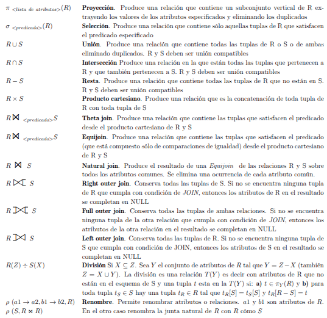

### Lista equivalencias
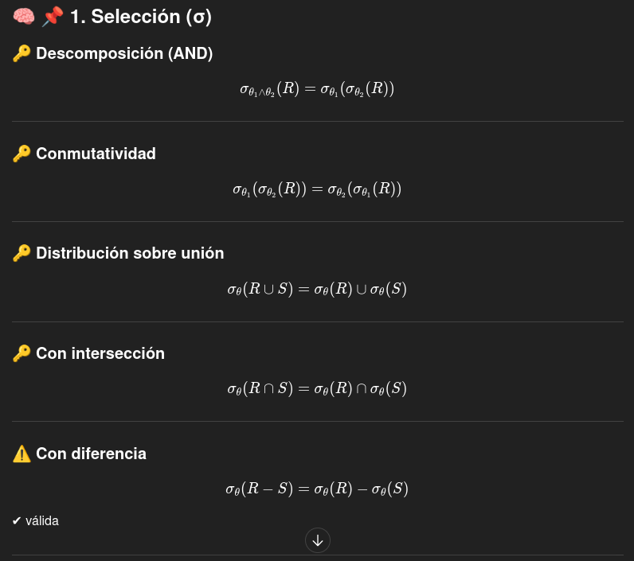
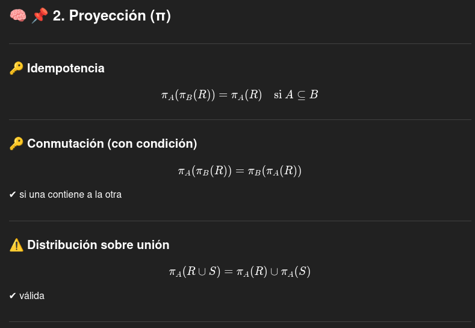
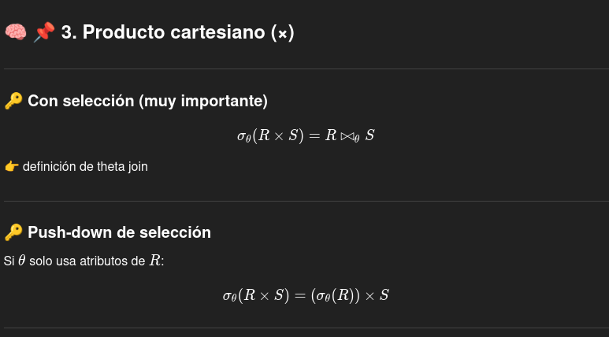
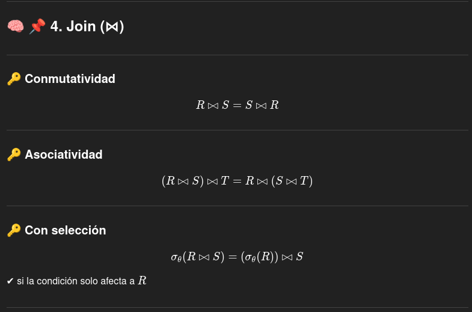
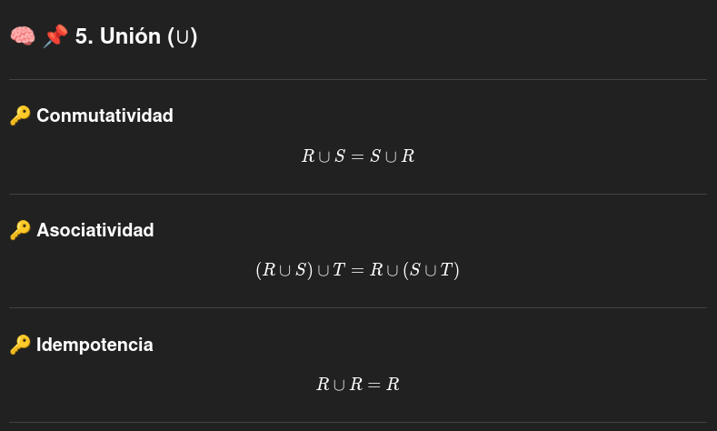
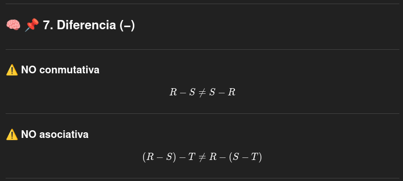
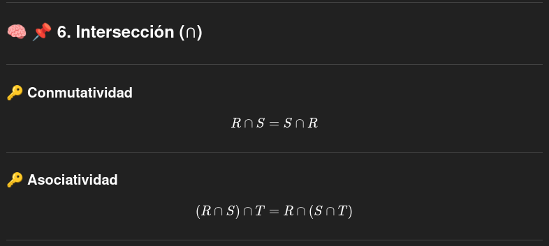

## Indices
Un **indice** de un atributo **A** en una relacion es una estructura de data que hace mas eficiente la busquedad de esas tuplas que posee un valor fijo para el atributo **A**. Podemos pensar que los indices como un arbol binario de busquead de pares (clave,valor), en donde la clave es asociada con un valor que es el conjunto de ubicaciones de las tuplas que posee a **a** en el componente para el atributo **A**.
esto suele servir para cuando **A** es comparado con un valor constante.

### Por que usar indices?
cuando una relacion es muy larga, es muy caro escanaer todas las tuplas para obtener aquellas que cumplen una determinada condicion. La forma naive de implmentarlo sera obtener todas las tuplas y testear la condicion sobre las mismas. Sera mas facil poder genera una forma que me permita obtener aquellas que satifacen una condicion de forma directa. 
la idea es que el indice nos permite tener una estructura de datos auxiliar para acelerar el accesos a registros de una relacion mediante la asociado de valores de atributos con us ubiacion fisicas. 

## DISEÑO DE BASES DE DATOS
**TRANSACCIONES:** las transacciones son grupos de queries que deben ser ejecutadas de forma atomica e isolada una de otra. Cada query o modifaicion a su vez puede ser considera como una transaccion a su vez.
Una transaccion debe ser **Perudurable**, esto implica que el efecto de cualquier transaccion completa debe ser preservado incluso cuando el sistema falla al completar la transaccion
El proceso de una transaccion tiene dos partes:
- Control de concurrencia o sheduler: se encarga de asegurar atomicidad y aislamiento de las transacciones.
- manager de loggeo y recuperacion, responsable de la perdurabilidad de las transacciones.

El procesador de transacciones debe ocuparse de que las transacciones se ejeucten de forma correcta, para esto realiza las siguientes tareas.
- **LOGGEO**: para poder asegurar la **durabilidad**, cada cambio se loggea de forma separada en el disco. El **manager de log** sigue varias politicas diseñadas para segurar de que mas alla de que el sistema falla, el **manager de recuperacion** podra examinar los logs de los cambios y restaurar la base a un estado consistente.
El **manager de log** escribe los logs en un buffer y negocia con el **buffer manager** para que los logs se escriban a disco en un tiempo apropiado.
- **CONTROL DE CONCURRENCIA:** cada transaccion debe simular que se ejecuta de forma aislada, pero en realidad dentro del sistema habran multiples transacciones ejecutandose. 
De esta forma el **scheduler** debe asugurarse que las acciones individuales de multiples transacciones son ejecutadas de forma tal que el efecto final es el mismo si se hubieran ejecutado una a la vez.
Para hacer esto se suelen mantener **locks** en ciertas partes de la base. Estos **locks** preveen que dos transacciones accedan a la misma data de forma que genere errores. Estos se suelen gauardar en memoria principal, en lo que se denomina como **lock table**.
- **RESOLUCION DE DEADLOCKS:** cuando las transacciones compiten por un recursos por medio de los **locks** que el scheduler garantiza, se peude genera situaciones donde ninguna siga progresando por que cada una necesita algo que la otra transaccion necesita. El **manager de transacciones** tendra el podes intervenir y cancelar una o mas transacciones para que las otras puedas seguir porgresando. 

**FORMA EN LA ACTUA LA TRANSACCION:** El **manager de transacciones** le enviara mensajes al **manager de loggeo**, al **manager de buffer** para preguntar para saber cuando es posible o necesario copiar el buffer al disco y al **procesador de queries** para ejecutar las queries y otras operaciones que incluyan la transaccion.
Cuando se produzca algun choque el **manager de recuperacion** se activa. este examina los logs y los utiliza si es necesario. 

## FORMA CORRECTA DE EJECUCION DE UNA TRANSACCION ##
para definir esto asumimos que una base da datos esta formado por elementos, donde cada elemento posee un valor que puede ser modificado o accesido por una transaccion. algunos elementos puede ser:
- Relaciones
- Bloques o paginas de disco
- Tuplas u objetos individuales
Una base de datos posee un estado, que es un valor para cada unos de sus elementos. Los estados se pueden dividir como:
- **consistentes:** significa que satisfacen todas las constrains de un esquema de base de datos, como constrins de clave o constrains de valores. A su vez debe satisafec toda constrins implicita por el diseño de la base.
Un principio fundamental con respecto a esto es el **principio de correctitud**, que especifica que si una transaccion en ausencia de errores, y comienza con un estado consistente, el estado de la base debe ser consistente al terminar la transaccion.

## OPERACIONES PRIMITIVAS DE LAS TRANSACCIONES ##
Hay 3 epacios de direcciones que interactuan entre ellos:
- El espacio de bloques de disco sosteniendo los elementos de la base de datos
- La memoria virtual o principal que es manejada por el **manager de buffer**
- el espacio de direcciones local utilizado por transacciones
para que una transaccion pueda leer un elemento de una base de datos, el elemento debe ser traido a los buffers de memoria principal, si no estasn ahi todavia. Luego el contenido puede ser leido por la transacion en su propio espacio de direcciones.Escribir en un elemento sigue el camino inverso.
El valor no siempre se esrcribe al buffer de forma inmediata, esta decision depende del **buffer manager**.
La primitivas que usaremos para definir las operaciones seran:
- $INPUT(X):$ copia el bloque de disco que contiene un elemento de la base X a la memoria del buffer.
- $READ(X,t):$ copia el elemento X de la base a la variable local t de la transaccion.
- $WRITE(X,t):$ copia el valor de la variable local t al elemento X de la base en la memoria del buffer.
- $OUTPUT(X):$ copia el bloque que contiene X desde su buffer al disco.
para red y write, si el bloque no esta en memoria primero lo traigo a disco por medio de input.
Las operciones anteriores tienen sentido si el elemento de bases de datos. 

## UNDO LOGGING ##
El primer estilo de loggeo que tenemos es **undo logging**, realiza reparaciones a la base de datos deshaciendo el efecto de transacciones que pueden no haberse completado antes de la caida del sistema.

### RECORDS DE LOGS ###
Un bloque de logs a la vez esta compuesto de record de logs, donde cada uno representa los eventos de la transaccion. POr lo general se crean en la memoria principal y luego se los ubica por medio del **buffer manager**.
Hay varios tipos de records de logs: 

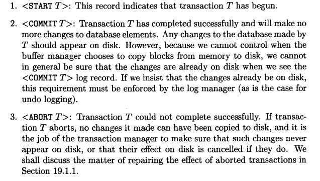

El otro tipo de record que sera necesario sera el **record de actualizacion**, que sera una tripla $<T,X,v>$. El significado de esto es que la transaccion **T** modifico el elemento **X** y su valor anterior era **v**.
Este tipo de record refleja una accion de **WRITE**.

### REGLAS DE UNO LOGGIN ###
- **U1:** si la transaccion **T** mdifica elemento de la base **X**, luego el log record de la forma $<T,X,v>$ debe ser escrito al disco antes que el valor nuevo de **X** se escrito al disco.
- **U2:** si una transaccion se comitea, luego si record de commit de beser escrito disco luego de que todos los elementos de la base moficados por la transaccion hayan sido escrito en disco. 
Esto implica que los logs records deben ser subidos a disco siguiendo este orden:
- Los logs recorde que indican cambios en los elemntos de la base
- Los cambios en si de los elementos
- El record de COMMIT 
Para poder forzar los logs record al dicos, el **manager de transacciones** posee un comando **flush log** que permite copiar a disco cualquier bloque que todavia no haya sido copiado al mismo. 

### RECUPERACION USANDO UNDO LOGGING ###
El **mamanager de recuperacion** utilizara los logs para poder restaurar la base de datos a uns esatado consistente por medio de los logs generados. Para este caso nos basaremos en una idea sencilla, donde ser recorrern todos los logs mas haya del largo que este tenga.
Por la regla **U2** si tenemos un record de **COMMMIT** todos los cambios que realizo la transaccion **T** ya fueron escrito a disco previamente. Por lo tanto esta transaccion **T** no dejo a la base en un estado incosistente.
En cambio si econtramos un record **START** sin un record de **COMMIT** puede ser que haya habido cambios que no se hayan copiado al disco. En este caso **T** es una transaccion inocmpeta que debe ser deshacida. 
Por medio de la regla **U1** sabemos que para todo cambio realizado por la transaccion hay un record de la fgorma $<T,X,v>$ que deberia estar en disocoa antes de la caidad del sistema. 
De esta forma durante la recuperacion, debemos escribir el valor de **v** en **X**, que era el valor anterior al cambio realizado por la transaccion.
Como a su vez debe haber multiples transacciones que alteraron **X**, se debe seguir un orden en el cual se restauran los valores. 
Luego de esto se debe guardar un record para cada transaccion **T** incompleta que ha sido abortada.

### CHECKPOINTING ###
Cuando una transaccion logrea que su record de **COMMIT** llegue a disco, el resto de sus records de operaciones no es necesario.
se podria pensar que esos logs de deberian borrar, pero no podemos. Esto se debe a que multiples transacciones ejecutan a la vez. 
La forma de solucionar estos problemas es por medio de **checkpoint** los logs de forma periodica. en esteos puntos de chequeo, se realiza:
- Se dejan de aceptar nuevas transacciones
- Se espera a que todos los commits de transacciones activos o abortados escriban su record de commit o abort en el log
- Se flushea el log al disco
- se escribe un log de checkpoint y se flushea el mismo a disoc
- Se vuelven a aceptar transacciones. 
Todas las transacciones que terminaron en el checkpoint, lograron que todos sus cambios hayan llegado al disco. Por lo tanto no sera necesario restaurar algunos de esas transaciones durante la recuperacion del sistema.
De esta forma todo log anterior a el chekpoint podra ser eliminado.  
 
### CHEKPOINT ACTIVO ###
El problema de la tecnica de checkepoint, es que al realizar esto se debe parar el sistema, lo que puede generar una caida en el tiempo de respuesta.
La solucion a esto sera el **checkpint activo**. 
En este en caso se escribe lo de la forma $<START CPKPT(T_1, .., T_k)>$ y se flushea el log, donde cada $T_i$ representa uan transaccion que todavia no fue commiteada o escrito sus cambios a disco. Se espera hasta que estas transacciones commitean o abroten pero sin prohibir que entren nuevas transacciones.
Cuando todas las transaccion activas terminan se envia un nuevo record que indica la finalizacion del checkpoint y se flushea el log. Para resturar los logs veremos los siguiente:
- Si primero nos cruzamos con $<END CPTK>$, sabemos que todas las transacciones incompletas comenzaron luego de  $<START CPKPT(T_1, .., T_k)>$.  Luego debemos escanear para atras hatsa el proximo $START CKPT$ y luego prara, todos los logs previos no seran utiles y puede ser descartados.
- Si primero nos cruzamos con $<START CPKPT(T_1, .., T_k)>$ luego la caida ocurrio dentro del checkpoint. pero las unica trasnacciones incompletar seran aquellas antes del $<START CPKPT(T_1, .., T_k)>$, y aquellas $T_i$ que no se completaron. 

## REDO LOGGING ##
El problema de **UNDO LOGGING** es que no podemos commitear una transaccion sin que antes se escriba toda la data que se modifico a disco. El **REDO LOGGING** nos permite evitar el backup inmediato de los elemento de bases a disco.
Las difenencia con **UNDO LOGGING** son:
- mientras que **UNDO LOGGING** cancela el efecto de transacciones incompletar y ignora quellas commiteadas, redo loggin ignora aquella que no fueron completadas y repetir lo cambios de aquellas comiteadas. 
- Mientras que **UNDO LOGGING** requiere que escribamos a disoc los cambios realizados antes del commit. **REDO LOGGING** requiere que el commit aparezca antes de los cambios. 
- A diferencia del **UNDO LOGGING** para recuperar en el **REDO LOGGING** necesitamos los nuevos valores, no los viejos. 

### REGLAS DE REDO LOGGIN ###
Cambia la interpretacion de la tupla, ahora $<T,X,v>$ representa que la transaccion T escribio el valor v en elemento X. cada vez que se modifica un elemento se debe cargar este record.
Solo tendremos una regla:
- **R1:** Antes de modificar cualquier elemento de la base es necesario que todos los logs pertenencientes a la modificacion del elemento **X**, incluido el record de modificacion como el de commit, deben estar en el disco. con redo tendremos el siguiente orden:
- Primero los logs que indica los cambios 
- Luego el log de commit
- Luego se realizan los cambios de los elementos. 

### RECUPERACION CON REDO LOGGING
La ventaja de este modelo es que las transaccion incompletas pueden ser tratada como si nunca ocurrieron. Mas alla de esto, las transacciones commiteadas prensentan el problema, tal que no sabemos cual de sus cambios si llegaron a disco.
De esta forma para recuperar el sistema por medio de este modelo:
- se identifican las transacciones que comitearon
- Se escanean desde el comienzo. Luego por cada tupla $<T,X,v>$:
  - Si T no es uan transaccion comiteada no se hace nada
  - si T es una transaccion commiete, escribimos el valor de **v** para el elemento **X**
- Para cada transaccion no completada **T**, escribimos un record de abort en el log y lo flusheamos. 

### CHEKPOINTS EN REDO LOGGING
Tiene un problema que **UNDO LOGGING** no posee como los cambios hechos por las transacciones puede ser copiados a disco mucho tiempo despues de cuando se commiteo la misma, no nos podemos limitar a transacciones que estan activas a la hora de realizar un chekcpoint.
Deberemos, al comienzo y fin del checkpoint, escribir a disco todos los elementos que fueron modificados por las transacciones comiteadas. Para esto se llevara un traqueo de que biffers estan **sucios** esto implica que fueron escritos pero no cargados al disco. 
Para poder llevar a cabo un chekcpoint activo, tendremos los siguientes pasos:
- Escribir un $<START CKPT (T_1,... ,T_k)>$, donde cada $T_i$ son las transacciones activas pero no comiteadas y luego hacer un flush del log.
- Escribir al disco todos los elemntos de base que fueron escritos la buffer pero no al disco, para las transacciones que habian comiteado cuando $START CKPT$ se escribio al log.
- Escribir un $<END CKPT>$ y hacer un flush de log.

### RECUPERACION CON CHECKPOINT EN REDO LOG
En este caso tenemos varios casos para analizar:
-  Si el ultimo log antes de la caidad es $<END CKPT>$, ahora sabemos que todo valor escrito por una transaccion que comiteo antes de $<START CKPT (T_i,... ,T_k)>$ posee sus valores en disco. pero toda transaccion que esta entre las $T_i$ y comenzo depues del comienzo del checkpoint puede tener cambios que todavia no fueron a disco, mas alla de que hayan comiteado.
De esta forma para realizar la recuperacion solo nos tenemos que preocupar por aquellas transaciones entre las $T_i$ y las que arrancaron despues. No hay que analizar nada mas atras de eso.
- Si ultimo log antes de la caida es $<START CKPT (T_i,... ,T_k)>$ no podemos asegurar que las transacciones que comitearon antes de este log hayan tenido sus cambios en disco. Por lo tanto tenemos que buscar el proximo $<END CKPT>$ y seguir el caso anterior.

## UNDO\REDO LOGGING
Aprovecha lo mejor de ambos mundos.
### REGLAS DEL UNDO/REDO LOGGING
la tupla de record log cuando se actualiza un valor ahora tendra 4 valores, $<T,X,v,w>$ donde significa que las transaccion **T** cambio el valor de **X**, si valor anterior es **v** y su nuevo valor sera **w**.
Tendremos solo una regla:
- **UR1:** Antes de moficiar cualquier elemento **X** en el disco por cambios hechos por una transaccion, es necesario que el log aparezca en el disco.

### RECUPERACION CON UNDO/REDO LOGGING
En este caso tenemos toda la informacion tanto para deshacer como volver a aplicar un cambio. La politica sera:
- Rehacer todas los transacciones commiteadas siguiendo un orden de erliest-first.
- Deshacer todas las transacciones incompletas siguiendo un orden de latest first. 

### CHEKPOINTING EN UNDO/REDO 
Un checkpoint activo es mas sencillo en este modelo:
- Se escribe un log $<START CKPT (T_i, . . . , T_k)>$ donde $T_i$ son todas las transacciones activas y se flushea el log. 
- Se escriben al disco todos los buffers que estan sucios. Todos los buffers, no solo aquellos comiteados por transacciones.
- Escribimos un $<END CKPT>$ y hacemos un flush del log. 

## CONTROL DE CONCURRENCIAS
El timing de cada paso dentro de transacciones diferentes debe ser regulado de alguna manera. Esta regulacion es llevada a cabo por el **scheduler**. Este control busca asegurar que las transacciones preserver su consistencia cuando se ejecutan de forma simultanea. 
Cuando la transaccion realiza un escritura o lectura, le pasa la accion al scheduler. El scheduler decidar si esa accion se debe realizar en el momento o esperar un cierto tiempo para realizar la misma, como tambein puede abortar la transaccion. 

### SHEDULES
un **schedule** es un conjunto de acciones realizadas por una o mas transacciones. Cuando estudiamos esto hay que entender que las acciones de escritura y lectura no se realizan sobre disco, sino que se hacen sobre los buffers de memoria. 

### SERIAL SCHEUDLES
Un **schedule** sera **serial** si consiste en todas las acciones de una transaccion y luego todas las acciones de la otra transaccion, y asi sucesivamente. 

### SCHEDULES SERIALIZABLES
El principio de la transaccio9nes deci que toda **schedule** serial, preserva la consistencua del estado de una base de datos. 
De esta forma podemos decir que un **schedule** $S$ sera serializable si hay un **schedule** serial $S^´$, tal que para cada estado inicial de la base, el efecto de $S$ y $S^´$ es el mismo.

## NOTACION
para hablar de trasnsaccion nos referimos como $r_i(X)$ o $w_i(X)$ a que una transaccion $T_i$ leyo o escribio en el elemento $X$.

## CONFLICTOS DE SERIALIZACION
hablamos de **conflicto** cuando: si tengo un par deacciones de un schedule de forma consecutiva, si su orden es intercambiado, luego el comportamiento de al menos una transacion cambia.

Situaciones que no generan conflicto:

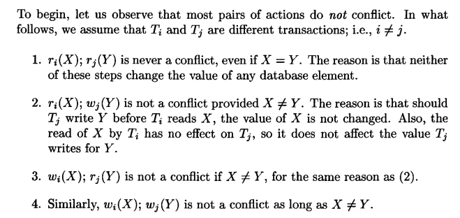

Situaciones de conflicto comunes:

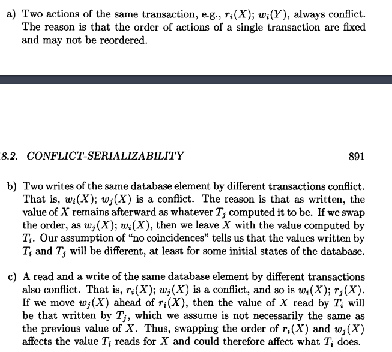

La conclusion general de esto sera que las transacciones podemos generan cambios, al menos que:
- Involucren los mismos elementos de bases de datos
- Al menos uno sea una escritura

Esto genera dos terminos nuevos para schedules:
- **Conflicto-equivalente:** si uno puede ser convertido en otro por medio de una secuencia de swaps no conflictivos o de acciones ayacentes.
- **conflicto-serializable:-** si es **confilcto-equivalente** a un sheduler serial.

## TEST PRAR SERIALIZACION CONFLICTIVA
Las acciones en conflicto ponen constrains sobre el orden de las transacciones. Si estas constrains no se contraiden, podemos encontrar un schedule que sea confilcto equivalente. 
Dado un **Schedule** $S$, que envuelven a las transacciones $T_1$ y $T_2$, entre las otras transacciones, decimos que $T_1$ toma precedencia sobre $T_2$, escrito como $T_1 <_{S} T_2$, si hay acciones $A_1$ de $T_1$ y acciones $A_2$ de $T_2$ tal que:
- $A_1$ esta antes que $A_2$ en $S$
- $A_1$ y $A_2$ involucran el mimso elemento de base
- al menos $A_1$ o $A_2$ es una accion de estcritura.
Estas son las condiciones exactas sobres las cuales no podemos hacer swap entre $A_1$ y $A_2$ 

Esta nocion de precedencia se puede resumir en un grafo. Los nodos de precedencia seran las transacciones del schedule. donde cada nodo estara taggeado con $T_i$ para cada transaccion dada, habra un arco para cada para de nodos que cumpla que $T_i <_s T_j$

Para saber si **S** sera **conflicto serializable**, construimos el grafo de precedencia para **S** y nos preguntamos si hay ciclos. Si los hay luego **S** no sera conflicto serializable. 
A su vez, si calculo el orden topologico del mimso me dara un orden serail **conflicto equivalente**

### GENERACION DE SERIALIZACION POR MEDIO DE LOCKS
La idea de esto es una transaccion obtiene locks sobre los elementos de la base para poder manipularlos de forma aislada, no permitiendo que otras acciones accedan al mismo si ya es utilizado por otra transaccion.

### LOCKS
De los capitulos anteriores sabemos que el **scheduler** tedra la responsabilidad de tomar los pedidos de las transacciones y permiterles actuar o bloquearlos por ciertos tiempo.

Cuando tenemos un scheduler con locking, este buscara forzar la conflictiva-serializada. Cuando un scheduler utiliza locks, las transacciones deberan pedir o liberar los locks aparte de las acciones de lectura y escritura. 
- consistenia de las transaccions:
  - una transacciones sobre podra leer o escribir un elemento se previamente obtuvo el lokc de ese elemento o todavia nio lo libero
  - si uan transaccion genera el lokc de un elemento, debe liberarlo en el futuro.
- Legalidad de schedule: Dos transacciones nos podran bloquear el mimso elemnto. 

Para entender esto generamos dos nuevas acciones: 
- $L_i(X):$ la transaccion $T_i$ bloquea el elemento $X$
- $U_i(X):$ la transaccion $T_i$ desbloquea el elemento $X$

## SCHEDULER CON LOCKING
Si un request no es dado, la transaccion que lo envio se demora y espera hasyta que el sheduler le de permiso. El scheduler tendra lo que se denomina como **lock table** , donde por cada elemento de la base posee si una transaccion mantiene un bloqueo sobre el mismo. 

## LOCKING DE DOS FASES
Por medio de este podemos garantizar que un schedule legal de transacciones consistentes es conflicto-serializable:
- En cada transaccion, todas las acciones de lock estan precedidas por una acion de unlock.

### SISTEMA DE LOCKING CON MULTIPLES MODOS DE LOCKS
Se introducen los tipos de locks, por lo general se habla de locks para escritura y para lectura. 