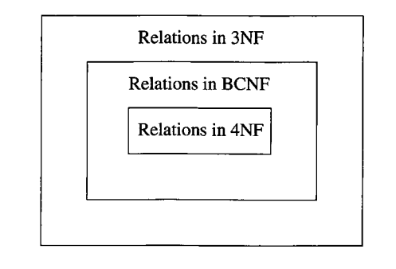
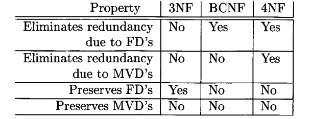

# Resumen de Bases de Datos
## Modelo de data
Nos permite decribir data o informacion. la descripcion contiene 3 partes: 
- estructura de la data:  
- operaciones de la data: en modelos de bases de datos estan limitadas las operaciones, por una cuestion de
  eficienca.
- Constrains de la data: Son limitaciones sobre lo que puede ser la data. 

Actualmente hay dos modelos fuertes con respecto a como representar los sistemas de bases de datos:
- El modelo relacional: se basa en tablas. gran parte del estudio de este modelo se basa en ver como se implementan estas tablas.
En la mayoria de veces las realciones no esta implementadas como estructuras en la memoria principal, a la hora de implmentarlas fisicamente hay que tener en cuenta la necesidad de a acceder a relaciones muy grandes que viven en el disco. Las operaciones estaran asociadas a algebra relacional. 
- El modelo semiestructurado: se asemaja mas a arboles o grafos. El principal representante es XML, que permite repsentar informacion de forma jerarquica usando elmentos taggeados. 

se podira pensar que el moldeo semiestrcturado posee mayor flexibilidad que el modelo relacional, pero mas alla de esto el modelo relational suele ser el mas preferido. Como la bases de datos son grandes,. se necesicete ser eficiente a la ahora de acceder o modificar data. A us vez de ser simple de utilizar. Estos dos objetivos son logrados por el modelo relacional:
- Provee una forma simple y limitada de modelar la data que es versatil como para poder modelar todo tipo de relacion
- Porvee un cojunto limtiad de operciones pero utiles.
Todo junto convierte las limitaciones en mejoras, permitiendo construir lengaujes que permiten expresar consultas de una forma muy buena. 

## Modelo relacional
Permite representar data de una forma muy sencilla, como una tabla de dos dimensiones llamada relacion. 
Terminos importantes del modelo: 
### Atributos:
- son las columnas de una relacion. decriben el significado de una entrada debajo de una columna. 
### Esquemas: 
- El nombre de una relacion y el cojunto de atributos para la misma se llama esquema de la relacion. 
  Mas alla de que los atributos se los tome como cojunto, se suele establecer un order para mostrarlos dentro de la relacion. 
El conjunto de esquemas de relaciones es llamada **esquema relacional de la base de datos**. Los atributos dentro de un esquema no son una lista, sino que solo seran un conjunto. se suele especificar un orden en la forma que mostrarmos los tributos en la relacion. 
### Tuplas:
- Es cualquier fila mas alla del encabezado que posee el nombre de los atributos. 
### Dominio:
- Cada elemento de una tupla debe ser atomico, por lo que debe pertenecer a algun tipo elemental. No pueden ser tipos que puedan ser divisibles en partes mas pequeñas. el dominio sera este tipo particular de cada atributo. 
### Intancia:
- es un cojunto de tuplas de una relacion dada. 
### Claves:
- un conjunto de atributos forma una clave de una relacion si no permitimos que dos tuplas en una instancia tengan los mismo valores en todos los atributos de la clave. Por lo general dentro del modelo se suelen usar calves artificiales, dado que no seria correcto asumir que los valores de un cierto atributo seran unicos entra las distintas tuplas. 

## Historia del modelo relacional
Surge a partir de un paper excrito **Ted Codd** en 1970. En este se propone que la informacion deberia ser presentada como tablas llamadas **relaciones**.
Por detras, se tendria una estrctura compleja que permitiria la repsuesta reapída frente a ciertas consultas que se le haga. 
Para 1990 este tipo de modelos se convirtieron en la idea a seguir, mas alla de esto la idea sobre modelos de bases de datos fue cambiando.

## Operaciones
Para poder realizar operacion de manipulacion de informacion, sus conceptos se sostiene sobre el **Algebra relacional**. La idea es definir un lengauje especifico para bases de datos, siendo util definirlo sobre estos concepto al ser menos poderoso, esto hace que sea mas eificiente y sencillo de programar. 
En un momento las bases relacionales se construian directamente sobre el algebra relacionla, hoy ya no es tan asi, sino que usan ese modelo como su base.

**Algebra:** Esta formado por un cojunto de operadores y operando atomicos. nos permite generar expresiones operando operadores a operandos atomicos. En el algebra relacional los operandos atomicos, son la variables que representan relaciones y contsntes que son relaciones finitas. 

**Operaciones:** se puede dividir en: 
- Operaciones clasica: union, interseccion y diferencia.
- Operaciones que remueven parte de una relacion: seleccion y poryeccion.
- Operafciones que combinan tuplas de dos relaciones: porducto cartesiano y tuplas. 
- Operaciones de renombre: no afectan a las tuplas pero si cambian el esqeuma de la relacion.

Estas expresiones dentro del algebra se llaman **querires** o **consultas**.

**Operaciones conocidas:**
- **Union:** $R \cup S$ conjunto de elemeento que que estan en R o S.
- **Interseccion:** $R \cap S$, conjunto de elementos que estan en R y S.
- **Diferencia:** $R - S$. Cojunto de lementos que estan en R pero no en S.

Para poder aplicar esto es necesarios que:
- R y S tengas esquemas con conjuntos de atributos identicos y el dominio de cada atribtuo debe ser el mimso para R y S.
- Antes de computar cualquier de estas relaciones, las oclumnas de R y S deben estar oredenadas para que los atributos esten en el mimso orden para ambas realciones

**Proyeccion:** se utiliza para producir desde una relacion **R**, una nuvea que posee algunas columnas de **R**. Para identiifarla se establecen el conjunto de argumentos que se van a extraer de la misma. a la hora de hacer una poryeccion, si hay tuplas repertidas en la misma, estas se eliminan.

**Seleccion:**  Aplicado a una relacion **R** produce una nueva relacion como subconjuntos de tuplas de **R**. Contiene los mismos atribnutos que **R**
Por lo general se expresan asignando una condicion sobre los atributos, es decir las tuplas obtenidas por medio de la seleccion seran aquellas que satisfacgan algunas codicion **C**. la condiicion se aplica sobre toda tuplas perteneciente a la realcion dada. 

**Producto Cartesiano:** se denota como **R X S**, donde **R** y **S** son dos conjuntos, y el resultado de la operacion es un conjunto de pares, donde el primero elemento pertence a **R** y el segundo pertence a **S**.Como los elemntos de **R** y **S** son tuplas, el resultado de su porudtco cartesano sera un cojunto de tuplas aun mas grande en longitud.por lo genral los componete sde la tupla de la izquierda estarn antes que los de la tupla de la derecha. 
Si un atributo posee el mismo nombre en ambas realciones, hya que genra un nuevo nombre para al menos alguno de ellos dos. 

**Natural joins:** dado dos relaciones se busca unir aquellas tuplas que matchhean de alguna manera. Los que buscamos matchear son atributos entre relaciones.
En este caso lo que hacemos es myachear aquellas tuplas que esten de acuerdo en algun atributo comun de los esquemas **R** y **S**. De esta forma un tupla de **R** y otra tupla de **S** conforman un par si y solo si ambas tuplas estan de acuuedo en un conjunto de atributos especificados. EL resultado es lo que se denomina como **Tupla joineada** o **joined tuple**.

**Theta joins:** La idea es generar pares de tuplas pero en este caso con otro tipo de condiciones. En este caso usamos condiciones mas complejas que solo el matcheo en el valor de un conjunto de atributos. En este caso la expresion **theta** indica la posibilidad de incluir una condicion mas compleja.
la forma de computar esto ser:
- realizar un producto cartesiano de las relaciones **R** y **S**.
- seleccionar del preducto de las mismas quellas tuplas que satisfagan la condicion dada.

A partir de estas operaciones basicas podemos generar expresiones mas complejas que nos permiten la union de las mismas con el fin de realizar consultas a nuestra base. por lo general podemos tener mas de una exprtesion que representa la misma consulta.

**Renombre:** exite un operador que nos permite renombrar las relaciones.El operador recibe una realcion **S**, y al aplicarse sobre **R**, contendra las mismas tuplas con nombres distintos.

### Equivalencias de operadores: ###

## Constrains
A la hora de querer exprsarlas hay de dos tipos: 
- Expresar que no queremos que un valor dentro de uma realcion sea vacio
- Expresar que cada tuplas de R tambien debe ser reasultado de S

## Teoria de diseño de bases relacionales 

Hay muchas maneras de diseñar un esquema de base relacional para una aplicacion. Mas alla de esto siempre un esquema tendra lugar para poder mejorarse. 
Por lo general los mayores problemas los esquemas surgen de queres combinar mucha informacion en una sola relacion. 
Hay una teoria solida sobre la nocion de **dependecia** que nos permite definir que hace a un buen esquema de base relacional. 

### Dependencia funcional 
Una **dependencia funcional** sobre una relacion **R** sostiene que si dos tuplas de **R** estan de acuerdo en los atributos $A_1$, $A_2$, ... $A_n$
entonces deben estar de acuerdo en otra lista de atributos $B_1$, $B_2$, ... $B_n$. Cuando hablamos de que las tuplas estan de acuerdo en sus atributos, implica que poseen el mismo valor. 
Si para cada instancia de **R** tenemos que la dependencia funcional es verdadera entonces digo que **R** la satisface.
Es una generalizacion para la nocion de clave dentro de la relacion.

### Claves de una relacion
Decimos que uno o mas atributos es una clave de una relacion si: 
- Esos atribtuos determina funcionalmnente todos los demas atributos de la relacion. 
- Ningun subconjunto de la la clave debe poder determinar funcionalmente al resto de los atributos, la clave debe ser minima.
Bajo esto decimos que es un conjutno minimal que determina toda la relacion

Por lo general una relacion puede tener mas de una clave, donde una se suele identitificar como primaria. La teoria de dependencia funcional no le da ningun rol especial a la clave primaria. 
Se suele hablar de dependecia funcional tal que si $A_1$, $A_2$, ... $A_n$ -> $B_1$, $B_2$, ... $B_n$ entonces puedo tomar una funcion que tome como argumentos el conjunto de atributos A y me devuelva B. Esta funcion no se puede definir en el sentido matematico. 

### Superclaves
Un conjunto de atributos que contiene una clave es una **super clave**. cada clave es una superclave, pero no todas las superclaves son minimas. 
Por lo tanto la superclave es un cojunto de atributos que que determina funcionalmente a los otros atributos, pero que no es minimal. 
Sera un cojunto no minimal que determina toda la relacion.

En otros libros se suele hablar de de clave candidata para referirse a los que nosotros le decimos clave.

### Reglas sobre dependemcia funcional 
#### Razonando sobre dependencias funcionales
Vamos a ver como se puede inferir distintas dependencias funcionales. Dentro de esto podemos tener una nocion de equivalencia sobres conjuntos de **FD**:
- Dos conjuntos de **FD**, **S** y **T** son equivalentes si el conjunto de relaciones que satisface **S** es le mismo al que satisface **T**
- De forma general, un cojunto de **FD** sigue a un cojunto de **FD** **T** si todas la relaciones que satisface **T** tambien satisfacen **S**

#### Reglas de combinacion o spliteo 
podemos decir que: 
- Dada un depedencia funcional $A_1$, $A_2$, ... $A_n$ -> $B_1$, $B_2$, ... $B_n$ podemos remplezar por un conjunto de dependencias funcionales tal que 
$A_1$, $A_2$, ... $A_n$ -> $B_i$ para i desde 1 A m, esta sera la **regla de spliteo**.
-- De forma analoga, dada una dependencia funcional de la forma $A_1$, $A_2$, ... $A_n$ -> $B_i$ para i desde 1 A m podemo tranformlar a una dependencia funcional de la forma $A_1$, $A_2$, ... $A_n$ -> $B_1$, $B_2$, ... $B_n. Esta sera la **regla de combinacion**.

### Dependencia funcionales triviales
La dependencia funcional se considera trivial si se mantiene para cada instancia de la relacion, mas alla de cualquier constrains que se asuma. Por ejemplo, si consideramos la dependencia funcional $A_1$, $A_2$, ... $A_n$ -> $B_1$, $B_2$, ... $B_n$ donde {$B_i$} es subcojunto de {$A_i$}, entonces es una dependencia trivial.

### Clausura de atributos
suponiendo que {$A_1$, $A_2$, ... $A_n$} es un conjunto de atributos y **S** es un conjunto de dependencias funcionales. la clausura de {$A_1$, $A_2$, ... $A_n$} bajo **S**
es un cojunto de atributos **B** donde para cada relacion que satisfga todas las dependencias funcionales en el conjunto **S**, entonces tambien satisface que $A_1$, $A_2$, ... $A_n$ -> B. la clausura de un conjunto de atributos {$A_1$, $A_2$, ... $A_n$} se escribira como {$A_1$, $A_2$, ... $A_n$} + .
De esta forma lo que establece la clausura {$A_2$, ... $A_n$}+ son todos los aitributos que puedo deducir con A_2$, ... $A_n$. Es decir la clasura de un cojunto de atribtuos **X** sera el conjunto de atributos que queda funcionalmente determinado por **X** en todas las relaciones que satifacen S. La idea de hablar de un **S** generico es que no dependo de la tabla concreta en la que me estoy desarrrollando.

Al poder computar la clausura de un conjunto de atributos para un determinado conjunto de dependencias funcionales, podemos testear cualquier dependencia funcional. 
Si el valor **B** esta dentro de la clausura entonces $A_1$, $A_2$, ... $A_n$ -> B, en caso contrario podemos decir que la dependencia funcional no sigue a S. 

Notemos que si {$A_1$, $A_2$, ... $A_n$} + es un conjunto de todos los atributos de una relacion si $A_1$, $A_2$, ... $A_n$ es una superclave de la relacion. 
Esto nos da una forma de chequear si un conjunto de atrituros es una clave, viendo si la clausura de estos es igual a todos los atributos y luego si tomando algun set de esta clausra no obtengo todos los atributos, por lo tanto es minimal. 

### Regla de transitividad
Se deduce sobre dos depdencias funcionales. si $A_1$, $A_2$, ... $A_n$ -> $B_1$, $B_2$, ... $B_n$ y $B_1$, $B_2$, ... $B_n$ -> $C_1$, $C_2$, ... $C_n$ 
entonces $A_1$, $A_2$, ... $A_n$ -> $C_1$, $C_2$, ... $C_n$. 

### Clausura de dependencias funcionales
A veces hay opciones para representar el conjunto completo de dependencias funcionales de una relacion. Si tenemos un cojunto **S** de dependencicas funcionales, cualquier otro cojunto **FD**  equivalente a **S** es un basico de **S**. Intentamos considerar solo bases donde las **FD** posee un solo atributo del lado derecho. 
un basico minimo de una relacion es un basico **B** si cumple que :
- Todas las **FD** de **B** tienen solo un atributo del lado derecho 
- Si alguna **FD** se remuve de **B**, el resultado no es mas un basis. 
- Si paara alguna **FD** en **B** removemos uno mas atributos del lado izquierdo de **F**, el resultado no es mas un basico **S**.

### Proyectando dependenncias funcionales
***Proyeccion:*** nos permite producir desde una relacion **R** una nueva relacion que solo tiene algunas columnas de la relacion **R** original. la expresion $PI_{A_1, A2,..A_n}$(R) se refiera a que solo tomo las columnas de los atributos $A_1, A_2,...A_n$

la proyeccion de un cojunto de **DFs** ***S***, sera todas las DFs tal que:
- Siguen de S
- Incluye solo atributos de $R_1$, siendo $R_1$ una proyeccion de R.

## Diseño de esquemas de bases relacionales
El mal diseño de un esquema de base relacional puede genera diversos errores. 

### Anomalias
podemos encontrar el siguiente tipo de anomalias:
- **Redundancia**: La informacion esta repetida en muchas tuplas.
- **Anomalias de actualizacion**: podemos cambiar la informacion en una tupla y dejear inalterada la misma informacion en otra tupla. 
- **Anomalias de borrado**: si un conjunto de valores se vuelven vacios, puede ser que perdamos otra informacion como efecto colateral. 

## Formas normales
las formas normales son un conjunto de reglas que nos permiten evitar las anomalias mencionadas. Da un cojunto de propiedades que debe cumplir una relacion de acuerdo a las **relaciones de dependencia**. Describe la forma en la que se van a organizar los atributos en las tablas. Dentro de las mas importantes tenemos **la forma normal de boyce-codd** y **la tercera forma normal**.
nos dan el piso para el proceso de descomposicion. la idea es partiendo de una relacion universal e ir descomponiendo hasta llegar a la forma normal. 

### Primera Forma Normal
Todas las relaciones estan en forma normal de acuedo a nuestra definicion de modelo relacional. Una relacion esta en primera forma normal si y solo si todas los atributos son atomicos. si tuviera una lista de campos que crece exponencialmente tampoco es atomico. los atributos que almaceno deben ser atomicos. dentro de la relacion los aitrbutos que tengo debenser atomicos, si yo tengo nota_1, nota_2, nota_3 como atributo no tengo atomicidad. 

### Segunda Forma Normal 
Para definir esto tenemos que un atributo se lo considera primo si es miembro de alguna clave. Consideramos que una relacion esta en segunda forma normal si todo atributo no primo **A** en **R** no es parcialemnte dependiente de alguna clave de **R**. Esta forma normal solo tiene sentido si la clave es compuesta, de ser simple ya va estar en segunda forma normal. 
si tengo una clave compuesta, por ejemplo tengo una tabla notas donde la clave es materia y lu. si en esa tabla pongo ademas el nombre de la materias, el nombre de la materias va a depedner solo del codigo de la materias. aca violo la segunda forma normal, tengo un atributo que pertenece a una parte de la clave.

## Descomposicion de relaciones
Para eliminar las anomalias se deben descomponer las relaciones. La descomposicion de **R** nos permite splitear los atributos de **R** para construir los esquemas de dos nuevas relaciones. Dada una relacion **R** con atributos $A_1$, $A_2$, ... $A_n$, podemos descompoenter a **R** en dos relaciones **S** con atributos  $B_1$, $B_2$, ... $B_n$ y otra relacion **T** con atributos $C_1$, $C_2$, ... $C_n$ tal que cumple que:
- La union de los atributos $B_i$ con los atributos $C_i$ forman los atributos $A_i$
- S es igual a la proyeccion de los atributos $B_1,...b_m$ sobre la relacion ***R***
- T es igual a la poryeccion de loa atributos $C_1,...C_k$ sobre la relacion ***R***

La redundancia no aplica a claves, estan se podran repetir dado que son la forma unica de representar un elemento y tener su referencia. 

### Forma normal de Boyce-Codd
La idea de descomposicion es poder cambiar una relacion por varias, de forma tal que no se exhiban anomalias. Hay una simple condicion frente a la cual se garantiza que no existan las anomalias anteriores. Esa condicion es **La forma normal de Boyce-CODD**:
- Si una relacion R esta en **BCNF** si y solo si cada vez que tenemos una dependencia funcional no trivial de la forma $A_1$, $A_2$, ... $A_n$ -> $B_1$, $B_2$, ... $B_n$ para **R**, entonces $A_1$, $A_2$, ... $A_n$ es una superclave de **R**
Otra forma de pensarlo es que el lado izquiero de toda dependencia funcional no trivial debe ser una superclave, que es equivalente a pensar que el lado izquierdo de toda dependecia funcional no trivial debe contener una clave. 

Lo que nos permite esto es que toda dependencia funcional este ligada a una clave, por lo tanto no hay dependencia ocultas o duplicaciones innecesarias. 
De esta forma **BCNF** elimina las anomalias porque evita las **DF** donde el determinante no identifica univocamente a las tuplas. 

La idea es repitiendo un proceso hasta que todas nuestras relaciones se ecuentren en **BCNF**. la idea es siempre partir de aquella **FD** que esta violando el concepto de **BCNF**

Exiten algunos casos triviales con respecto a relaciones y este tipo de formas normales. Suponiendo una relacion donde tengo dos atributos **A** y **B**, puedo ver que:
- No hay depedendencia funcional no triviales, por lo tanto **BCNF** se mantiene, dado que solo una dependencia funcional no trivial puede romper la condicion. 
- A -> B mantiene, pero B --> no. Por lo tanto A es la unica clave y cada dependencia funcional no trivial contiene A a la izquierda. Por lo tanto no se viola **BCNF**
- Lo mismo ocurre para el caso donde B-> A se mantiene, perp no A-> B.
- Como ambas se mantienen, luego A y B son claves. Podemos afirmar que para culquier dependencia funcional al menos una de estas va a estra a la izquierda, por lo tanto se cumple BCNF.
Esto cloncluye que toda relacion con dos atributos va a estar en **BCNF**.

## Lo bueno y malo de las descomposiciones
Las descomposiciones tendran buenas cosas como malas. dentro de esto podemos hablar de: 
- Eliminacion de anomalias
- Recuperacion de informacion
- Preservacion de dependencias

En este modelo de normalizacion podemos obtener las condicion 1 y 2. A su vez podemos generear una nueva forma de descomposicion que nos de 2 y 3. pero no hay forma de obtener las 3 codiciones al mismo tiempo. 

### recuperacion de informacion
Por que planteamos un algoritmo si sabiamos que toda relacion de dos atributos esta en **BCNF**? El problema esta en que descomponer una relacion de esta forma, no nos permite unir las relaciones de la descomposicion y obtener todas las instancia de **R** de nuevo. esta se denomina como **lossless join**. El poblema esta en que partir de este razonamiento no puede llegar a obtener tuplas fantasma por medio de la union (join) de las relaciones de la descomposicion.
Si utilizamos el algoritmo planteado para obtener la descomposicion, luego la relacion original puede ser recuperada mediante un join natural. Esto es algo que no todas las formas de obtener una descompsicion pueden asumir.  
Para poder comprobar esto existe lo que se denomina como **The chase test** para ver la presencia de **Lossless join**. la idea de esta prueba es ver que pasaria si hago un join usando solo las dependencias funcionales. De esta forma se genera un tabla donde se posee como columnas los atributos de **R** y una fila por cada subrelacion. 
Para el valor de los atributos de cada fila, se usa un simbolo fijo si estos atributos estan en la relacion, y de caso contrario se les agrega un indice.
Luego utilizando las dependencias funcionales, de la forma X -> Y si dos filas coinciden en X deben coincidir en Y, y de esta forma se igualan los simbolos.
La descomposion sera lossles si alguna fila termina con todos los atributos iguales. 

### Preservacion de dependencias
Muchas veces en la descomposicion **BCNF** hay que hacer un tradeoff entre poser un **lossless join** y poder **conserva las dependencias**.
Cuando hablamos de conservar dependencias es que aparezcan de forma explicita en alguna de las relaciones de la descomposocion. Al eliminarse una **FD**, por ejemplo una que expresa transitivida, solo puede ser recuperada por medio de un join de sus atributos.
De esta form el algoritmo propuesto nos permite eliminar anomalicas y resuperar la informacion, pero no preservar las dependencias.

## Tercera Forma Normal
Es una forma normal mas relajada que **BCNF**  En este caso la tercera forma normal nos permite tener lossless join y dependecy preservation, pero no permite eliminar las anomalias, dejando muchas veces redundancia. La preservar las **FD** nos permite la eveluacion de las mismas sin la necesidad de elbaorar joins con las otras relaciones.

Una relacion **R** esta en tercera forma normal si cuando $A_1,...,A_n$ -> $B_1,...,B_m$ es una **DF** no trivial, o bien {A_1,...,A_n} es una superclave o 
esos atributos $B_1,...,B_m$ que no estan entre las **As**, son miembros de alguna clave. Tambien se puede de definir como o bien la parte izquierda es una superclave o los valores **B** son primos.

## Dependencia multivaluada
Ocurre cuando dos atributos o conjunto de atributos son independientes uno del otro. Es un generalizacion de dependencia funcional. 
una **MVD** es una afirmacion sobre **R** donde cuando se fijan lo valores de un conjunto de atributos, entonces los valores en otros atributos son independientes de todos los otros valores de la relacion. Se puede definir como que  $A_1,...,A_n$ ->> $B_1,...,B_m$, donde si nos restrinjimos a las tuplas que tiene vaLores particualres para **A**, luego el cojunto de avlores de **B** es independiente del conjutno de atributos de **R** que no estan entre **A** y **B**.
mantiene la relacion para R si para cada tuple **t** y **u** de la relacion **R** que estan de acuerdo con todo los valores de **As**, podemos encontrar otra tupla **v** tal que esta de acuerdo: 
- Con **t** y **u** en los valores **As**
- con **t** en los valores de **Bs**
- con **u** en todos los atributos R que no estan entre las **As** y los **Bs**

Lo que nos permite es yo puedo combinar libremete los valores de B y el resto de los aitrbutos, siempre que mantenga el mismo A. La idea es que si tengo dos combinaciones posibles, todas las combinaciones cruzadas son posibles. Esto nos permite que dijada A, los valores B se puede combinar libremte con el resto de atributos.

la relacion de **MVD** de la forma X->> Y nos dice que si encontramos dos filas que que estan de acuerdo en el valor de **X**, luego puedo encontrar filas nuevas haicneod combinacion con los valores de **Y**

### Cuarta forma normal
En este caso, por medio de esta forma normal podemo eliminar todas las **MVDS** no triviales son eliminadas, como tambien todas las **DF** que violan las **BCNF**. 
Esto permite a su vez eliminar redeucnida. 

Sera en si la condicion de **BCNF** pero aplicada a **MVDs**. Podemos decir que una relacion en cuarta forma normal si $A_1,...,A_n$ ->> $B_1,...,B_m$
es una **MVD** no trivial y {$A_1,...,A_n$} es una super clave. 
Como la cuerta forma normal es una genralizacion de BCNF entonces una violacion en BCNF es tambien una violacion en la cuarta form,a normal. 

## Relacion sobre formas normales

La **cuarta forma normal** implica  **BCNF**, que a su vez implica **tercera forma normal**.

## Propiedades de las formas normales

